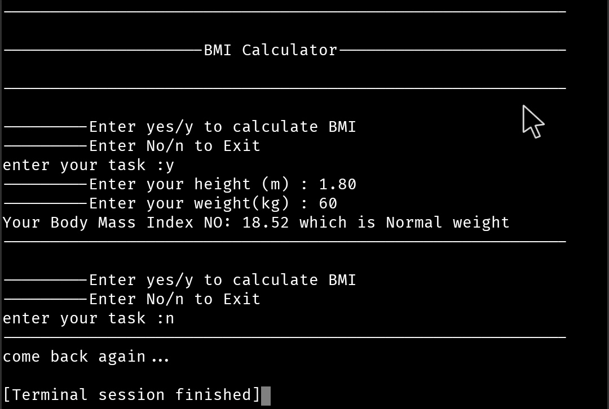

# BMI Calculator - Project Documentation

## Project Name

**BMI (Body Mass Index) Calculator**

## Overview

This is a simple Python command-line application that calculates a
user's Body Mass Index (BMI) using height (meters) and weight
(kilograms). It classifies the BMI into health categories and includes
basic exception handling.

## Formula

``` text
BMI = Weight (kg) / Height (m)^2
```

## Features

-   Calculate BMI
-   Classify BMI
-   Menu-driven interface
-   Handles invalid numeric input
-   Handles division by zero
-   Allows multiple calculations

## Program Flow

1.  Display menu.
2.  User enters `yes/y` or `no/n`.
3.  If `yes`, request height and weight.
4.  Calculate BMI.
5.  Display BMI category.
6.  Return to menu.
7.  If `no`, exit.

## Functions

### `calculateBMI()`

-   Accepts height and weight.
-   Calculates BMI.
-   Rounds BMI to 2 decimal places.
-   Prints BMI category.
-   Handles `ValueError` and `ZeroDivisionError`.

### `main()`

-   Displays menu.
-   Accepts user choice.
-   Calls `calculateBMI()`.
-   Exits when user enters `no` or `n`.

## BMI Categories

  BMI          Category
  ------------ ---------------
  ≤ 18.5       Underweight
  18.5--24.9   Normal Weight
  25--29.9     Overweight
  ≥ 30         Obese
  
## Program Output

The screenshot below demonstrates the successful execution of the BMI Calculator application.

- User selected **`y`** to calculate BMI.
- Height entered: **1.80 m**
- Weight entered: **60 kg**
- Calculated BMI: **18.52**
- BMI Category: **Normal Weight**
- User entered **`n`** to exit the application.



## Time Complexity

`O(1)`

## Space Complexity

`O(1)`
