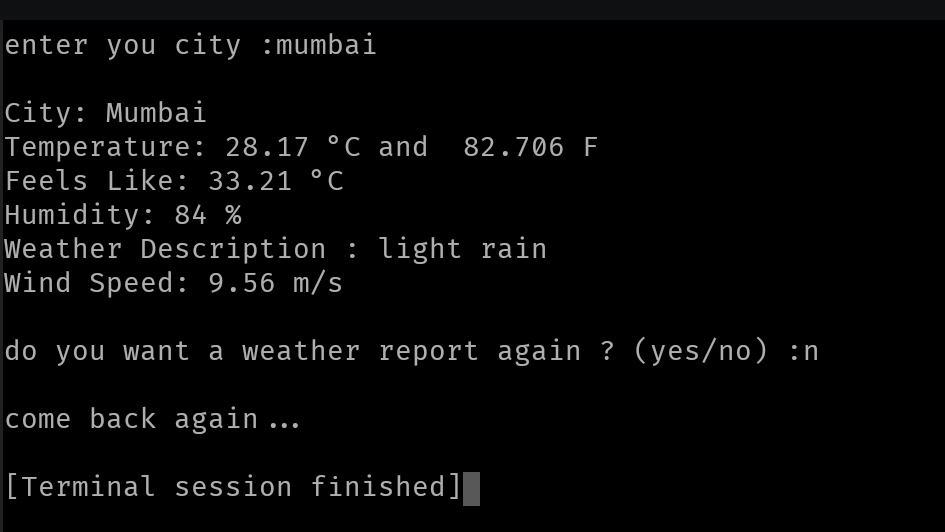

# Weather Report Application

## Overview

A Python command-line application that fetches live weather data using
the OpenWeatherMap API.

## Features

-   Search weather by city
-   Temperature in Celsius and Fahrenheit
-   Feels like temperature
-   Humidity
-   Weather description
-   Wind speed
-   Timeout and network error handling
-   Menu-driven interface

## Libraries

``` python
import requests
import os
from dotenv import load_dotenv
```

## Functions

### get_weather(CITY, API_KEY)

Fetches weather data from the API and displays it.

### main()

Runs the menu loop and handles exceptions.

## Output Screenshot



## Complexity

-   Time: O(1)
-   Space: O(1)

## Improvements

-   Validate empty input.
-   Handle invalid city names.
-   Round Fahrenheit.
-   Remove unused CITY parameter.
