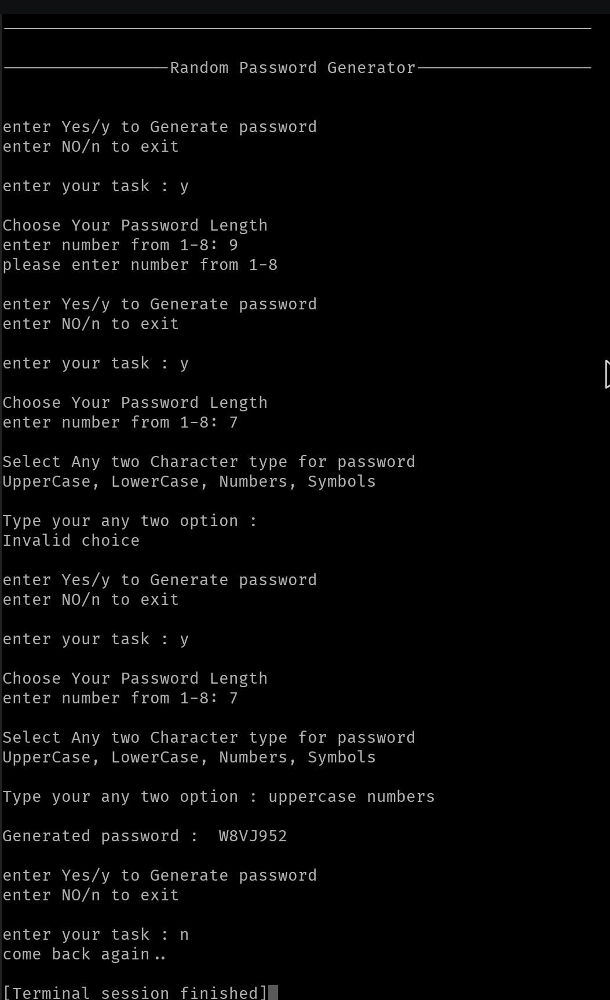

# Random Password Generator

## Overview

A command-line Python application that generates random passwords using
two selected character types and a user-defined password length.

## Features

-   Menu-driven interface
-   Password length validation (1-8)
-   Supports uppercase, lowercase, numbers, and symbols
-   Random password generation
-   Invalid input handling

## Libraries

``` python
import random
import string
```

## Functions

### GetType()

Returns the character set based on the two selected types.

### GeneratePass()

Generates and displays the password.

## Sample Output



The screenshot demonstrates: - Invalid length (9) is rejected. - Invalid
character combination is rejected. - Successful password generation. -
Exit option.

## Complexity

-   Time: O(n)
-   Space: O(n)
